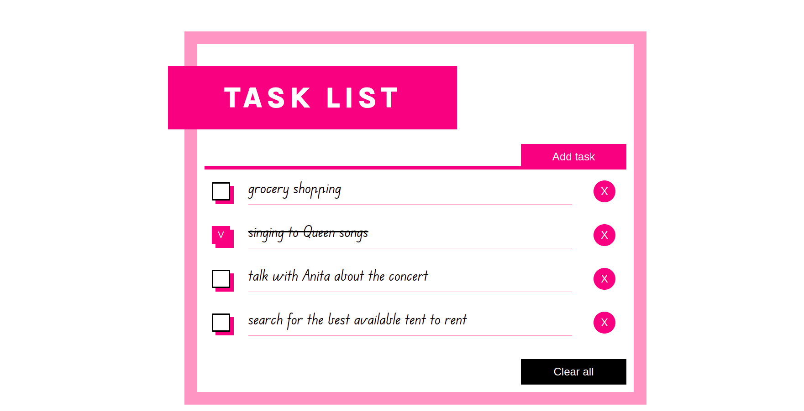

# To-do application

A simple web application. The classic one but with real, useful functionalities thanks to saving data in the local storage of user's browser. 



Users are able to:

- Add a task to list
- Tick the completed task
- Remove task from the list
- Clear all tasks and start a new list
- See a responsive, minimalistic page layout

## Live preview

[Github Pages](https://kmnkat.github.io/todo/)

## Built with

- Semantic HTML5 markup
- CSS custom properties
- Flexbox and CSS Grid
- Basic JavaScript 

### What I learned

In this project I've used `.nodeName`{:.js} the first time. It was a part of the event delegation logic. I found this event handling pattern very powerful and easy to code.


```js
 if(e.target.nodeName == "BUTTON") {
        ...
    }
 if(e.target.nodeName == "INPUT") {
    ...
    }
```


